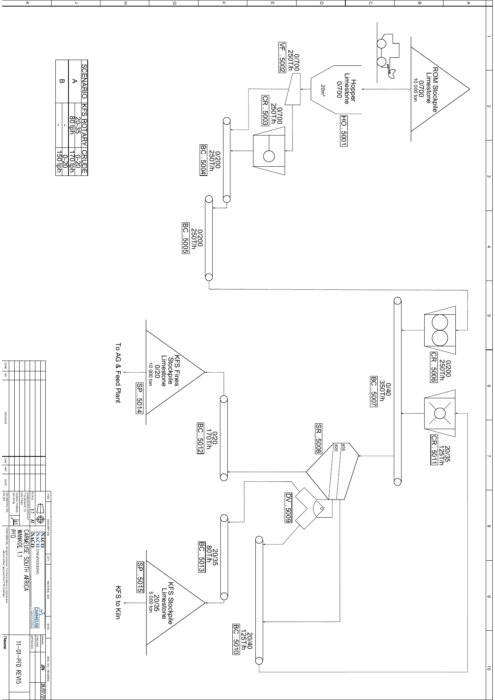

# DT-002 — Zone 1.1 Complete Sizing Note (model-exchange edition)

**by NOEZYS** — technical dossier DT-002, issued 2026-08-17. Internal note
for the model exchange with the client's colleague running Metso Bruno.
Tags: NACO 11-01-PFD REV15. All PSD tables are cumulative % passing.

## 1. Purpose and how to read this note

This note documents, end to end, how the WANKOE deterministic model computes zone 1.1: the machine sizing and the production capacity, with every particle-size distribution presented as CUMULATIVE PERCENT PASSING in table form. It is written for the model exchange with our colleague running Metso's Bruno simulator: section 3 is a full replay kit (all inputs, settings and calibration constants) so Bruno can be configured identically, sections 4 to 6 derive and apply the models, and section 9 confronts our figures with the NACO flowsheet design values, honestly. Nothing here needs to be trusted: every figure replays from the archived script (see the provenance footer), and any divergence between Bruno and this note is meaningful precisely because both sides are fully specified.

Language note: tags follow the NACO PFD 11-01-PFD REV15 everywhere. The model historically used spec-era tags; the zone-1.1 retag of 2026-08-17 renamed CR.5009 to CR.5006 and SR.5007 to SR.5008 (CR.5011 and CR.5003 were already aligned). Documents issued before that date carry the old tags, the machines are the same.

## 2. The flowsheet (PFD 11-01-PFD REV15)

The PFD plate is the contractual reference of this note; it is deliberately NOT reproduced inside this document (an A1 sheet does not survive page-size reduction) and travels as a separate PDF (20260806_Wankoe_1.1_PFD_REV15.pdf) to be opened full screen alongside. Chain: ROM stockpile 0/700 (10 000 t), truck to hopper HO.5001 (20 m3), vibrating feeder VF.5002 (250 t/h), primary crusher CR.5003 (0/700 to 0/200), conveyors BC.5004/BC.5005, toothed-roll sizer CR.5006 (0/200 to 0/40), conveyor BC.5007 to the double-deck screen SR.5008 (decks 35 and 20 mm), diverter DV.5009, loop crusher CR.5011 returning via BC.5010, products BC.5012 to SP.5014 (0/20 crude, 10 000 t, to AG and Feed plant) and BC.5013 to SP.5015 (KFS 20/35, 5 000 t, to kiln).

*(full-resolution PDF archived alongside: 20260806_Wankoe_1.1_PFD_REV15.pdf)*

### 2.1 Model boundary and scenario mapping

The model starts AT THE PIVOT: the feed curve is MEASURED by belt-cut at the primary station outlet, so the upstream chain (HO.5001, VF.5002, CR.5003, blending) is already inside the measured curve and is not recomputed. The modelled chain is CR.5006, then SR.5008 with the CR.5011 loop on the deck-1 oversize routed by DV.5009. PFD scenario A (KFS + crude) is the model's mode 1A; PFD scenario B (crude only, no KFS) is mode 1B, in which the 20/35 cut is recycled to CR.5011 instead of leaving as product, and the line feed drops to the re-bisected 172.0 t/h wet so the loop machine stays inside its vendor rating (section 9 discusses the 150 t/h difference with the sheet).

## 3. Replay kit: inputs, settings, calibration

Total-flow rule (project convention, load-bearing): every line feed rate is the TOTAL flow, WET basis (dry solids plus water), as a belt scale would weigh it. Mode 1A feed: 250.0 t/h wet; mode 1B feed: 172.0 t/h wet; feed moisture 7.0 % wet basis, dry weather photo. Feed F80 = 180.57 mm (measured 2026-08-08 belt-cut curve, completed by declared tail hypotheses H-FEED-1/2).

| Sieve (mm) | Feed cumulative % passing |
|---|---|
| 0.5 | 1.06 |
| 1 | 2.67 |
| 2 | 6.53 |
| 5 | 18.82 |
| 10 | 33.57 |
| 15 | 41.30 |
| 20 | 45.48 |
| 25 | 47.58 |
| 31.5 | 49.75 |
| 35 | 50.74 |
| 40 | 52.00 |
| 50 | 56.19 |
| 63 | 60.52 |
| 80 | 65.00 |
| 120 | 75.42 |
| 200 | 81.00 |
| 320 | 100.00 |

*The pivot feed curve, as Bruno should ingest it.*

| Setting | Value | Status |
|---|---|---|
| CR.5006 gap g (= product x80) | 60 mm | Client reference setting 2026-08-13; x80 = g validated 2026-08-08 |
| CR.5006 RR uniformity n | 1.35 | [H] pending vendor gradation table |
| SR.5008 apertures a1 / a2 | 35 / 20 mm | KFS window, sanctuarized by client ruling |
| Screen imperfection I | 0.15 | [H] literature value, client arbitration 2026-08-10; convention question open (see 4.3) |
| CR.5011 CSS (x80) | 30 mm (1A) / 18 mm (1B) | Mode changeover is a routine operation |
| CR.5011 rotor speed v | 30 m/s | Client 2026-08-14, minimum speed |
| Bond work index Wi | 12.54 kWh/t | [ref.] Fontaine, Belgian limestone (client Q2, 2026-08-11) |
| Impact breakage A_j / b_j | 60 / 0.8 | [H] pending drop-weight tests (none launched, client 2026-08-16) |
| Motor efficiency eta_m | 0.75 | absorbed = net / eta_m |
| Computation grid | x2 refinement (57 meshes) | Spec sieves remain the presentation format (this note's tables) |

## 4. The models, derived

### 4.1 M1, crusher product curve (truncated Rosin-Rammler)

Both crushers deliver a Rosin-Rammler (Weibull) product. Start from the RR cumulative passing P(x) = 1 - exp(-(x/xc)^n). The machine setting fixes the nominal product x80: requiring P(x80) = 0.8 gives exp(-(x80/xc)^n) = 0.2, hence (x80/xc)^n = ln 5 and xc = x80 / (ln 5)^(1/n) (the calibration constant m1_ln_arg = 5 is exactly this ln argument). Two physical corrections complete the model. TRUNCATION: a compression crusher cannot deliver lumps much larger than its setting, so the distribution is cut at xt = 1.7 x80 (trunc_factor) and rescaled by P(xt) so it reaches 100 % there. BYPASS: the feed fraction already finer than the setting passes through unchanged, so the delivered curve is the feed's fine part plus the crushed coarse share mapped through the truncated RR. Disclosed convention: after the truncation rescale the delivered product passes about 83 % at the nominal x80 (n = 1.35), i.e. its realized x80 is about 6 % finer than the setting; this is the spec's prescribed behavior, kept and disclosed.

### 4.2 M2, comminution power (Bond)

W = 10 Wi (1/sqrt(P80) - 1/sqrt(F80)) with P80 and F80 in micrometres and Wi = 12.54 kWh/t, clamped at zero if the product is coarser than the feed. Net power P_net = W Q (Q in t/h of dry solids); absorbed power = P_net / eta_m with eta_m = 0.75. The bond_coef = 10 is the classical 10 of Bond's third law.

### 4.3 M3, screen partition curve

Each deck is a reduced-efficiency partition: the probability that a particle of size x reports to the OVERSIZE is ro(x) = 1 / (1 + (d50c/x)^s), a logistic curve in log-size. The cut point is d50c = a k_d with k_d = 1.0 (cut at the aperture), and the sharpness comes from the imperfection I through s = ln 9 / ln(1/(1 - I)): the ln 9 makes s such that the curve spans its 10 % to 90 % recovery band over the factor (1-I)^-2 around d50c. The partition is applied interval by interval on the computation grid to the feed's mass fractions; oversize and undersize flows and curves follow by summation, which is why the screen conserves mass exactly by construction.

Honesty notes for the Bruno comparison, where the two simulators are most likely to differ: (1) ATTRIBUTION, the spec labels this curve Karra, but the implemented form is a logistic Reid/Plitt-family curve; Karra's published 1979 model is ro = 1 - exp(-0.693 (x/d50)^5.846) with a FIXED sharpness equivalent to a classic imperfection of about 0.13. (2) CONVENTION, with s = ln 9 / ln(1/(1-I)) the parameter I is a (d90-d10)/(2 d50)-type sharpness, not the classic (d75-d25)/(2 d50) imperfection of the literature that justified the 0.15 default; the realized classic imperfection at I = 0.15 is sinh(ln(1/(1-I))/2), about 0.081, meaning our screens are modelled about twice as sharp as a classic-0.15 screen. This convention question is an open arbitration on our side (expert clarification note pending). If Bruno's screen model is configured with a classic imperfection, MATCH THE REALIZED SHARPNESS (0.081), not the nominal 0.15, or the cut curves will diverge visibly around both apertures.

### 4.4 M4, screen area (VSMA / Fontaine form)

Required area A = U f_p / (Qb f0), where U is the deck undersize in t/h, f_p = 1.2 a peak factor, and Qb = 14 a^0.6 t/h/m2 the basic capacity at aperture a (mm). Attribution disclosure: Qb alone is not the published VSMA basic capacity; the EFFECTIVE capacity Qb f0 = 4.86 a^0.6 reproduces the VSMA Factor-A table within 5 % at the project cuts (29.3 vs 30.8 t/h/m2 at 20 mm, 41.0 vs 39.5 at 35 mm), the fitted f0 = 0.347 absorbing the VSMA factor string. Under rain the basic capacity is derated by the wet factor (0.75); the SR.5008 PURCHASE minima are client-decided on that rain duty (9.1 / 9.6 m2), while this note's dry-photo areas are the operating requirement.

### 4.5 M5, impact crusher (t10 / Ecs) and the loop

The impactor's breakage intensity comes from the rotor speed: specific energy Ecs = v^2 / 7 200 kWh/t (kinetic energy of the tip speed), then the JK-style characteristic t10 = A_j (1 - exp(-b_j Ecs)) with A_j = 60 and b_j = 0.8 [H]. The t10 sets the product curve SHAPE through the RR uniformity n = max(0.65, (30/t10)^0.3): a harder hit (higher t10) gives a flatter (better graded) product. The product curve is then M1's truncated RR with x80 = CSS and that n; power is M2 on the impactor's own F80 to P80. THE LOOP: SR.5008 deck-1 oversize (plus, in mode 1B, the 20/35 cut) feeds CR.5011, whose product returns to the screen feed. The engine solves this recycle as a fixed point, iterating until BOTH the recycled flow rate and its entire curve change by less than the tolerance; all figures in this note are the converged state.

## 5. Mode 1A, KFS production, full chain

Settings: gap 60 mm, CSS 30 mm, v 30 m/s, feed 250 t/h wet. The 20/35 cut leaves as KFS; the 0/20 undersize is the crude co-product; the deck-1 oversize loops through CR.5011.

| Machine | Duty at this mode | Power | Sizing check |
|---|---|---|---|
| CR.5006 toothed-roll sizer | 250.00 t/h wet (232.50 dry), F80 180.57 mm, P80 42.70 mm, x80 = gap = 60 mm | W = 0.312 kWh/t, P_net 72.5 kW, absorbed 96.6 kW (eta_m 0.75) | 100.0 % of the 250 t/h wet line rating |
| SR.5008 double-deck screen 35/20 | Feed 324.48 t/h wet (301.77 dry); feed context at 35 mm: 53.25 % passing a/2, 22.89 % oversize | n/a (screen) | Required areas: top 6.80 m2, bottom 7.15 m2. Purchase minima (client 2026-08-15, RAIN duty): 9.1 / 9.6 m2 |
| CR.5011 impact crusher (loop) | Loop load 74.48 t/h wet of 90 t/h vendor wet rating = 82.8 %; F80 63.02 mm, P80 29.30 mm, CSS 30 mm, v 30 m/s | Ecs 0.125 kWh/t, t10 5.7 %, n 1.65; W 0.233 kWh/t, absorbed 21.5 kW (installed 132 kW) | Recirculation 69.27 t/h dry |

| Sieve (mm) | Pivot feed | CR.5006 product | SR.5008 screen feed | SR.5008 deck-1 oversize +35 | SR.5008 deck-1 undersize 0/35 | SR.5008 20/35 cut -> KFS product | SR.5008 undersize 0/20 -> crude product | CR.5011 feed | CR.5011 product |
|---|---|---|---|---|---|---|---|---|---|
| Dry t/h | 232.50 | 232.50 | 301.77 | 69.27 | 232.50 | 57.85 | 174.65 | 69.27 | 69.27 |
| Wet t/h | 250.00 | 250.00 | 324.48 | 74.48 | 250.00 | 62.20 | 187.80 | 74.48 | 74.48 |
| P80 (mm) | 180.57 | 42.70 | 38.31 | 63.02 | 22.41 | 31.68 | 14.17 | 63.02 | 29.29 |
| 0.5 | 1.06 | 1.17 | 0.94 | 0.00 | 1.22 | 0.00 | 1.63 | 0.00 | 0.19 |
| 1 | 2.67 | 2.93 | 2.40 | 0.00 | 3.11 | 0.00 | 4.14 | 0.00 | 0.60 |
| 2 | 6.53 | 7.20 | 5.98 | 0.00 | 7.76 | 0.00 | 10.33 | 0.00 | 1.86 |
| 5 | 18.82 | 21.12 | 18.14 | 0.00 | 23.54 | 0.00 | 31.34 | 0.00 | 8.15 |
| 10 | 33.57 | 39.17 | 35.54 | 0.00 | 46.12 | 0.00 | 61.40 | 0.00 | 23.35 |
| 15 | 41.30 | 50.50 | 48.20 | 0.00 | 62.56 | 0.24 | 83.20 | 0.00 | 40.46 |
| 20 | 45.48 | 58.32 | 57.91 | 0.00 | 75.17 | 8.69 | 97.18 | 0.00 | 56.56 |
| 25 | 47.58 | 63.92 | 65.36 | 0.10 | 84.80 | 39.45 | 99.81 | 0.10 | 70.16 |
| 31.5 | 49.75 | 70.33 | 73.60 | 2.31 | 94.83 | 79.24 | 99.99 | 2.31 | 84.55 |
| 35 | 50.74 | 73.41 | 77.11 | 7.41 | 97.87 | 91.44 | 100.00 | 7.41 | 89.49 |
| 40 | 52.00 | 77.42 | 81.35 | 20.37 | 99.51 | 98.04 | 100.00 | 20.37 | 94.54 |
| 50 | 56.19 | 86.22 | 89.32 | 53.52 | 99.98 | 99.92 | 100.00 | 53.52 | 99.72 |
| 63 | 60.52 | 94.04 | 95.41 | 79.98 | 100.00 | 100.00 | 100.00 | 79.98 | 100.00 |
| 80 | 65.00 | 97.65 | 98.19 | 92.10 | 100.00 | 100.00 | 100.00 | 92.10 | 100.00 |
| 120 | 75.42 | 100.00 | 100.00 | 100.00 | 100.00 | 100.00 | 100.00 | 100.00 | 100.00 |
| 200 | 81.00 | 100.00 | 100.00 | 100.00 | 100.00 | 100.00 | 100.00 | 100.00 | 100.00 |
| 320 | 100.00 | 100.00 | 100.00 | 100.00 | 100.00 | 100.00 | 100.00 | 100.00 | 100.00 |

*Rows below the rates are CUMULATIVE % PASSING at each sieve.*

KFS quality check against the kiln envelope (max 30 % below 20 mm, min 55 % in 20/35, max 15 % above 35 mm): below 8.69 %, in cut 82.75 %, above 8.56 %, COMPLIANT. Zone mass balance closes by construction (partition curves conserve mass; the loop is converged).

## 6. Mode 1B, 0/20 campaigns, full chain

Settings change with the mode: CSS drops to 18 mm (at CSS 30 the 1B loop cannot pass material below 20 mm and diverges; 18 mm restores convergence), and the line feed drops to 172.0 t/h wet, the value re-bisected on the adopted quarry-target curve so the CR.5011 vendor guarantee of 90 t/h wet holds on BOTH feed curves. The 20/35 cut is recycled (no KFS is made, by definition of the mode).

| Machine | Duty at this mode | Power | Sizing check |
|---|---|---|---|
| CR.5006 toothed-roll sizer | 172.00 t/h wet (159.96 dry), F80 180.57 mm, P80 42.70 mm, x80 = gap = 60 mm | W = 0.312 kWh/t, P_net 49.9 kW, absorbed 66.5 kW (eta_m 0.75) | 68.8 % of the 250 t/h wet line rating |
| SR.5008 double-deck screen 35/20 | Feed 255.20 t/h wet (237.34 dry); feed context at 35 mm: 62.69 % passing a/2, 17.92 % oversize | n/a (screen) | Required areas: top 5.70 m2, bottom 6.55 m2. Purchase minima (client 2026-08-15, RAIN duty): 9.1 / 9.6 m2 |
| CR.5011 impact crusher (loop) | Loop load 83.20 t/h wet of 90 t/h vendor wet rating = 92.4 %; F80 55.63 mm, P80 17.66 mm, CSS 18 mm, v 30 m/s | Ecs 0.125 kWh/t, t10 5.7 %, n 1.65; W 0.412 kWh/t, absorbed 42.5 kW (installed 132 kW) | Recirculation 77.38 t/h dry |

| Sieve (mm) | Pivot feed | CR.5006 product | SR.5008 screen feed | SR.5008 deck-1 oversize +35 | SR.5008 deck-1 undersize 0/35 | SR.5008 20/35 cut -> recycled to CR.5011 | SR.5008 undersize 0/20 -> crude product | CR.5011 feed | CR.5011 product |
|---|---|---|---|---|---|---|---|---|---|
| Dry t/h | 159.96 | 159.96 | 237.34 | 42.46 | 194.88 | 34.92 | 159.96 | 77.38 | 77.38 |
| Wet t/h | 172.00 | 172.00 | 255.20 | 45.65 | 209.55 | 37.55 | 172.00 | 83.20 | 83.20 |
| P80 (mm) | 180.57 | 42.70 | 31.49 | 65.57 | 18.93 | 30.77 | 13.95 | 55.63 | 17.66 |
| 0.5 | 1.06 | 1.17 | 0.93 | 0.00 | 1.13 | 0.00 | 1.38 | 0.00 | 0.44 |
| 1 | 2.67 | 2.93 | 2.43 | 0.00 | 2.95 | 0.00 | 3.60 | 0.00 | 1.37 |
| 2 | 6.53 | 7.20 | 6.24 | 0.00 | 7.60 | 0.00 | 9.25 | 0.00 | 4.24 |
| 5 | 18.82 | 21.12 | 20.02 | 0.00 | 24.38 | 0.00 | 29.70 | 0.00 | 17.75 |
| 10 | 33.57 | 39.17 | 41.30 | 0.00 | 50.30 | 0.00 | 61.27 | 0.00 | 45.70 |
| 15 | 41.30 | 50.50 | 56.76 | 0.00 | 69.13 | 0.37 | 84.14 | 0.17 | 69.71 |
| 20 | 45.48 | 58.32 | 67.80 | 0.01 | 82.57 | 12.57 | 97.85 | 5.67 | 87.39 |
| 25 | 47.58 | 63.92 | 74.32 | 0.11 | 90.49 | 47.45 | 99.88 | 21.48 | 95.82 |
| 31.5 | 49.75 | 70.33 | 80.00 | 1.98 | 97.00 | 83.29 | 100.00 | 38.67 | 100.00 |
| 35 | 50.74 | 73.41 | 82.08 | 5.86 | 98.69 | 92.69 | 100.00 | 45.04 | 100.00 |
| 40 | 52.00 | 77.42 | 84.78 | 16.46 | 99.66 | 98.12 | 100.00 | 53.31 | 100.00 |
| 50 | 56.19 | 86.22 | 90.71 | 48.14 | 99.98 | 99.91 | 100.00 | 71.50 | 100.00 |
| 63 | 60.52 | 94.04 | 95.98 | 77.53 | 100.00 | 100.00 | 100.00 | 87.67 | 100.00 |
| 80 | 65.00 | 97.65 | 98.41 | 91.14 | 100.00 | 100.00 | 100.00 | 95.14 | 100.00 |
| 120 | 75.42 | 100.00 | 100.00 | 100.00 | 100.00 | 100.00 | 100.00 | 100.00 | 100.00 |
| 200 | 81.00 | 100.00 | 100.00 | 100.00 | 100.00 | 100.00 | 100.00 | 100.00 | 100.00 |
| 320 | 100.00 | 100.00 | 100.00 | 100.00 | 100.00 | 100.00 | 100.00 | 100.00 | 100.00 |

*Rows below the rates are CUMULATIVE % PASSING at each sieve.*

## 7. Machine sizing summary (what we buy and why)

| Machine | Sizing driver | Purchase decision |
|---|---|---|
| CR.5006 | 250 t/h wet continuous at gap 60; max lump 250 mm guaranteed by the quarry (ripping + face scalping); positive engagement of that lump | Twin-shaft toothed SIZER class (client ruling); vendor standard twin-drive package, 220 kW held in data; contractual product curve at the 0/60 setting is the tender's core |
| SR.5008 | The worst circumstance is RAIN (25 % of the season, line runs through): wet factor 0.75 consumes the former dry margin | Purchase minima 9.1 / 9.6 m2 = rain duty (client decision 2026-08-15); dry-photo requirement in this note is 6.80 / 7.15 m2 |
| CR.5011 | Mode-1B loop at 83.20 t/h wet against the 90 t/h wet vendor rating (92.4 %); mode-1A at 82.8 % | 90 t/h WET at CSS 18 is a written guarantee point of the tender; 132 kW per the reference machine documents; the 1B feed 172.0 was chosen precisely so this guarantee holds in all ruled circumstances |

## 8. Production capacity, annual translation

Principle (project rule): OPERATING HOURS ARE SET BY THE PRODUCTION TARGETS, never the reverse. Zone 1.1 runs a Saturday-extended single shift (ceiling 2 400 h/y). At the current plan the zone needs 1 366.6 h of mode 1A and 0.0 h of mode 1B: the 0/20 demand of the downstream zones is currently covered by the 1A co-product, so no dedicated 1B campaign is scheduled; the AUTO-1B rule (KFS is NEVER over-produced) would create 1B hours automatically if the 0/20 demand grew beyond the 1A co-production.

| Annual figure | Value |
|---|---|
| KFS production (firm) | 85 000 t |
| AgLime total | 141 929 t (incl. 0/20 conversion, client rule 2026-08-16) |
| FeedLime grits (firm) | 40 000 t |
| FeedLime fines | 60 000 t (production objective, served exactly) |
| UltraFin | 6 687 t (incl. zone-1.3 dedusting dust, client rule 2026-08-16) |
| 0/20 to landfill | 0 t (mandatory AgLime/FeedLime conversion, client rule) |
| KFS yield realized / required | 24.88 % / 24.88 % (equal by construction since the conversion rule) |

## 9. Adequacy with the PFD REV15 figures, honestly

The sheet's printed rates and this note's computed rates differ, and the difference is INFORMATIVE, not a disagreement about the flowsheet:

| Quantity (wet t/h) | PFD REV15 (design) | Engine (measured curve, mode 1A) |
|---|---|---|
| Fresh feed | 250 | 250 |
| SR.5008 screen feed (BC.5007) | 350 | 324 |
| KFS 20/35 (BC.5013) | 80 | 62 |
| Crude 0/20 (BC.5012) | 170 | 188 |
| Recycle (BC.5010) | 125 | 324 |
| Scenario B / mode 1B basis | 150 t/h crude PRODUCT | 172.0 t/h wet FEED (re-bisected for the CR.5011 90 t/h wet guarantee) |

PFD scenario A: KFS 80 t/h vs engine ~62 t/h; crude 170 vs ~188 — the PFD figures assume the NACO DESIGN feed curve; the engine runs the MEASURED belt-cut curve (45.5 % already < 20 mm at the pivot). Same flowsheet, different feed curve: the gap is a FEED-CURVE question, not a flowsheet disagreement (same family as the KFS 80-vs-51 spec question).

PFD screen feed 350 t/h vs engine 324 t/h and PFD recycle 125 vs 324 — consistent with the finer measured feed (less +35 oversize, less recycle).

PFD scenario B (crude only, 150 t/h product) vs engine mode 1B (feed 172.0 t/h wet re-bisected 2026-08-15 so the CR.5011 90 t/h wet guarantee holds on both feed curves): same operating intent (no KFS), different sizing basis — the PFD states a PRODUCT rate, the engine sets the FEED so the loop machine survives.

For the Bruno exchange this is the first-order result to compare: run Bruno once with the NACO design curve and once with the measured belt-cut curve of section 3, and the 80-vs-62 gap should reproduce in Bruno too if its crusher and screen models are configured per sections 4.1 to 4.3. If it does, the two models agree that the question is geological (the feed curve), not mechanical (the machines).

## 10. Provenance and replay

Engine commit 27a64f0; scenario: modes 1A (250 t/h wet) + 1B (172.0 t/h wet, CSS 18), measured 2026-08-08 belt-cut feed, dry weather, reference settings g60/CSS30/v30. Replay without any assistant: PYTHONPATH=src python dossiers/DT-002/extract_dt002.py (regenerates dt002_data.json), then PYTHONPATH=src python dossiers/DT-002/render_dt002.py (regenerates this note and the Word document from that JSON). Every figure in this note comes from that JSON; none is hand-typed. The PFD is archived alongside (SHA-256 4c2cd3a447744542a0fb981e8e14bb9b50f4bab373da26a425824fb455f0275f, byte-identical to the 2026-08-12 docs/pfd/ archive). Declared hypotheses [H] remain hypotheses: no external test campaign has been launched (client decision 2026-08-16). Produced by NOEZYS.
